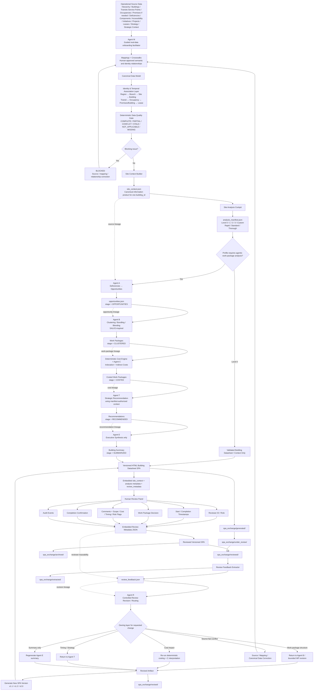

# Agentic Construction Work Package Pipeline

This view summarizes the current building-level workflow: real-data onboarding, canonical identity resolution, deterministic validation, configurable analysis, A-B-C-T-E transformation, HTML SPA human review, versioning, and controlled revision.

> Canonical identity rule: `Region -> Branch -> Site -> Building` is the selection hierarchy. Transit/service-point identity is connected to physical premises through temporal occupancy and lease relationships; it is not a substitute for `building_id`.



## Batch selection

The cockpit may select multiple regions, branches, sites and buildings. A batch selection is operational convenience only:

```text
one batch selection
    -> building run 1
    -> building run 2
    -> building run 3
    -> ...
```

Each building keeps an independent `analysis_manifest`, pipeline run, SPA, review and revision history.

## Core feedback loop

`Trusted canonical data -> configured analysis -> agents -> SPA -> human review -> structured feedback -> controlled routing/revision -> new SPA -> human review`

Reviewer feedback is evidence and instruction for revision. It does not silently replace authoritative source facts. A conflict with source data is routed back to the source/mapping/canonical layer.