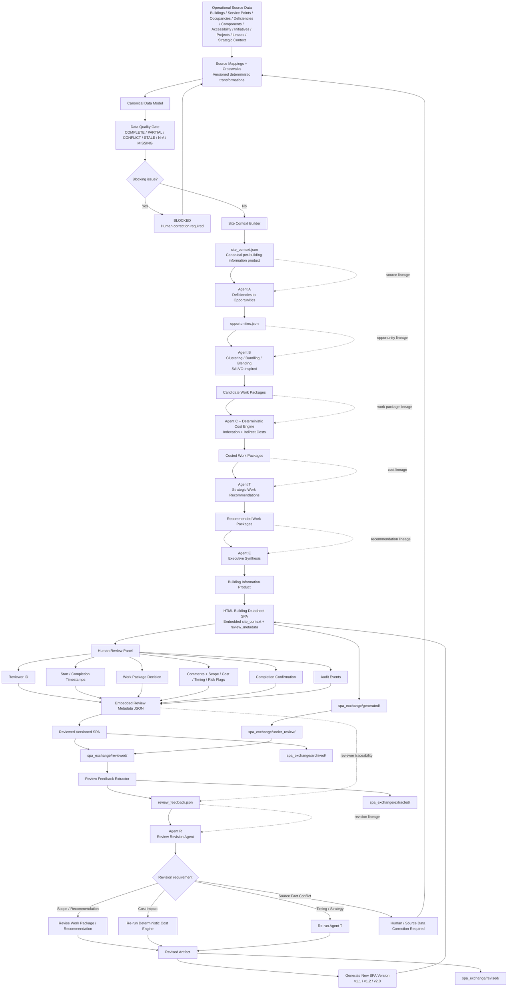

# Agentic Construction Work Package Pipeline

This view summarizes the source normalization, deterministic validation, agent sequence, HTML SPA human review, versioning, and revision loop.

## Core feedback loop

`Source data -> deterministic validation -> agents -> SPA -> human review -> structured feedback -> Agent R -> revised SPA -> human review`

Reviewer feedback is evidence and instruction for revision. It does not silently replace authoritative source facts. A conflict with source data is routed back to the source/mapping/validation layer.
